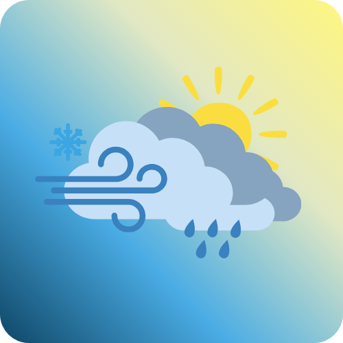

# Házi feladat specifikáció

Információk [itt](https://viaumb02.github.io/laborok/android/A01/)

## Mobilszoftver Laboratórium

### 2025.03.23. - 2025 tavaszi félév

### Németh Bálint - (MJB2CX)

### Laborvezető: Pomázi Krisztián

## Simple Weather

## Bemutatás

Az alkalmazás egy időjárásfigyelő rendszer, amely a legfrissebb meteorológiai információkat szolgáltatja a felhasználóknak. Az alkalmazás feladata a helyi és más helyszínek időjárási előrejelzéseinek könnyű elérhetősége, amely segíthet az általános felhasználókat a mindennapi tervezésben.

## Főbb funkciók

### Leírás

- Aktuális időjárás megjelenítése: A felhasználó aktuális helyzete, és által felvett más helyek listázása, amelyek külön-külön nézetben jelenítik meg a lekéri az aktuális időjárási adatokat.

- Előrejelzés megjelenítése: Az alkalmazás 7 napos tömör előrejelzést biztosít a kiválasztott helyszínekre. Többségében várható időjárás, napi maximum és minimum hőmérséklet.

- A lekért, és megjelenített adatok: hőmérséklet, hőérzet, relatív páratartalom, csapadék valószínűség, csapadék mennyiség, szélirány és szélsebesség. A várható hőmérséklet és időjárás órás bontásban.

- Város keresése geocoding alapján: A felhasználó kereshet városok szerint, hogy más helyek időjárását is megtekinthesse.

- Kedvencek kezelése: Lehetőség van kedvenc városok elmentésére, hogy az alkalmazás főképernyőről gyorsan elérhetők legyenek.

- A felhasználó aktuális pozíciójának használata. Ezt priorizáltan, első helyként tünteti fel a főképen.

- Az aktuális pozíció és kedvenc helyek időjárás adatainak frissítése alkamazás megnyitáskor, és manuálisan a felhasználó által.

- Offline adatok: A legutolsó lekért adatok mentése, hogy internetkapcsolat nélkül is elérhető legyen az utolsó előrejelzés.

- Időjárási adatok vizualizációja: Ábrák használata az időjárás adatok vizuális reprezentálására.

- Háttérben történő frissítés: Az alkalmazás óránként automatikusan megpróbálja frissíti az időjárási adatokat a háttérben, hogy mindig a lehető legfrissebb információ álljon rendelkezésre.

### User story-k

1. Mint felhasználó, szeretném hamar látni a friss aktuális helyi időjárást, hogy eldönthessem, milyen ruhát vegyek fel.
2. Mint felhasználó, szeretném megnézni az előrejelzést, hogy megtervezhessem a hétvégi programomat akár egy héttel előre.
3. Mint felhasználó, szeretném megnézni más települések aktuális és előrejelzett időjárását utazás céljából.
4. Mint felhasználó, szeretném, ha a további települések egyszerűen kereshetőek lennének.
5. Mint felhasználó, szeretném elmenteni a kedvenc településeimet, hogy ne kelljen mindig kikeresni őket.
6. Mint felhasználó, szeretném ábrákkal látni az adott időjárási viszontagságokat.
7. Mint felhasználó, szeretném internetkapcsolat nélkül is látni az utolsó előrejelzést.
8. Mint felhasználó, szeretném, ha az alkalmazás lehetőleg friss adatokat mutatna akkor is, ha ritkán nyitom meg internet kapcsolat mellett.

### Funckcionális követelmények

| **ID**  | **Leírás** |
|---------|-----------|
| **F01** | Az alkalmazás képes megjeleníteni az aktuális időjárást a felhasználó tartózkodási helye alapján. |
| **F02** | A felhasználó kereshet településeket, hogy megtekintse azok aktuális és előrejelzett időjárását. |
| **F03** | A felhasználó elmenthet és törölhet városokat a kedvencek listájából. |
| **F04** | Az alkalmazás 7 napos tömör időjárás-előrejelzést biztosít a kiválasztott helyszínekre. |
| **F05** | Az alkalmazás tárolja az utolsó letöltött adatokat, így internetkapcsolat nélkül is megtekinthető az utolsó előrejelzés. |
| **F06** | Az időjárási adatok főbb jellemzőit egyértelmű ábrákkal is megjeleníti. |
| **F07** | Az alkalmazás indításkor automatikusan frissíti az aktuális hely és a kedvencek időjárási adatait, ha van internetkapcsolat. |
| **F08** | A felhasználó manuálisan is frissítheti az adatokat egy frissítés gomb segítségével. |
| **F09** | Az alkalmazás óránként automatikusan megpróbálja frissíteni az időjárási adatokat a háttérben. |

### Nem funkcionális követelmények

| **ID**  | **Leírás** |
|---------|-----------|
| **NF01** | Az alkalmazásnak gyorsan és reszponzívan kell működnie, a hálózati hívások ellenére is. |
| **NF02** | Az alkalmazás törekedjen a magaserőforrás igényes komponensek (hálózat, helyadatok, stb.) csak szügségszerű használatára. |
| **NF03** | Az alkalmazásnak támogatnia kell a különböző kijelzőméreteket és orientációkat. |
| **NF04** | Az alkalmazásnak stabilan kell működnie internetkapcsolat nélküli módban is, az utolsó letöltött adatok használatával. |
| **NF05** | Az alkalmazásnak biztonságosan kell kezelnie a felhasználói adatokat és a tartózkodási hely információit. |

### Actorok

Az alkalmazásnak két aktora van:

- Az aktuális eszköz előtt lévő felhasználója, ő végez minden előtér műveletet és navigációt az alkalmazásban.
- Belső (internal) aktor, ami a háttérben a periódikus, és induláskor végzett adatlekérést végzi.

### Use-Case-ek

| **Use-Case**                                 | **Actor**   | **Leírás**                                                                                                                                                                                     |
| -------------------------------------------- | ----------- | ---------------------------------------------------------------------------------------------------------------------------------------------------------------------------------------------- |
| **Időjárás lekérdezése**                     | Felhasználó | A felhasználó beír egy várost vagy használja a tartózkodási helyét az aktuális időjárás lekéréséhez.                                                                                           |
| **Előrejelzés megtekintése**                 | Felhasználó | A felhasználó kiválaszt egy várost, majd megtekinti a 7 napos előrejelzést.                                                                                                                    |
| **Kedvenc városok kezelése**                 | Felhasználó | A felhasználó elmenthet és törölhet városokat a kedvencek listájából.                                                                                                                          |
| **Manuális adat frissítés**                  | Felhasználó | A felhasználó manuálisan frissítheti az időjárási adatokat egy frissítés gombbal.                                                                                                              |
| **Offline elérhetőség**                      | Felhasználó | Ha nincs internetkapcsolat, az alkalmazás az utolsó letöltött időjárási adatokat mutatja.                                                                                                      |
| **Adatok frissítése alkalmazás indításakor** | Rendszer    | Az alkalmazás automatikusan frissíti az aktuális pozíció és a kedvenc helyek időjárási adatait az indításkor, ha van internetkapcsolat.                                                        |
| **Háttérben történő frissítés**              | Rendszer    | Az alkalmazás óránként automatikusan frissíti az időjárási adatokat, hogy a felhasználó mindig a legfrissebb adatokat lássa a legutoljára ismert pozíciója és a kedvencekbe mentett helyeiről. |

#### Egyesített use-case diagram

## Képernyőtervek

A nézet tervek a Justinmind tervező programmal készültek: `/jim/simple-weather.vp`

### A kezdőképernyő terv

### A kereső nézet terv

### A kiválasztott település időjárás nézet terv

## Architektúra

Az alkalmazás az **MVVM (Model-View-ViewModel)** architektúrát követi, melyet **Hilt**-tel az órán tanultak szerint egészítettünk ki a dependency injection kezelésére.

### Az MVVM architektúra

- Modern Android fejlesztésben bevált és támogatott megközelítés.
- Elkülöníti a UI-t az üzleti logikától és az adatforrástól.

### Dagger-Hilt

- Egyszerűbb és átláthatóbb dependency injection.
- Könnyen integrálható ViewModel-ekkel, Repository-kal.
- Google hivatalosan támogatja Androidon.

## OpenMeteo API lerása

Swagger dokumentáció [itt](./assets/network-api.yml)
Grafikus megtekintés, vagy szerkesztés [ezzel](https://editor.swagger.io/) az eszközzel lehetséges.

## Fejlesztési dokumentációk

* [Hálózati és ORM réteg](Network_ORM.md)

